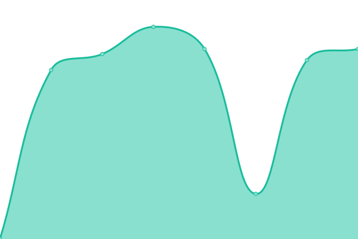

# <<<<<<< HEAD

<!--start: status pages-->
<!-- This summary is generated by Upptime (https://github.com/upptime/upptime) -->
<!-- Do not edit this manually, your changes will be overwritten -->
<!-- prettier-ignore -->
| URL | Status | History | Response Time | Uptime |
| --- | ------ | ------- | ------------- | ------ |
|  [Mobfixer](https://mobfixer.in) | 🟩 Up | [mobfixer.yml](https://github.com/iamrishan/status/commits/HEAD/history/mobfixer.yml) | 

 68ms
     
 | 

<a href="https://iamrishan.github.io/status/history/mobfixer">100.00%</a>
    

|  [Mobfixer CRM](https://crm.mobfixer.in) | 🟩 Up | [mobfixer-crm.yml](https://github.com/iamrishan/status/commits/HEAD/history/mobfixer-crm.yml) | 

 632ms
     
 | 

<a href="https://iamrishan.github.io/status/history/mobfixer-crm">100.00%</a>
    

|  [Mobfixer Academy](https://mobfixeracademy.com) | 🟩 Up | [mobfixer-academy.yml](https://github.com/iamrishan/status/commits/HEAD/history/mobfixer-academy.yml) | 

 396ms
     
 | 

<a href="https://iamrishan.github.io/status/history/mobfixer-academy">100.00%</a>
    

<!--end: status pages-->

[**Visit our status website →**](https://iamrishan.github.io/status)

> > > > > > > df4bcdaaba8c52ffd46e6747129dd9d5d7d8ede5
